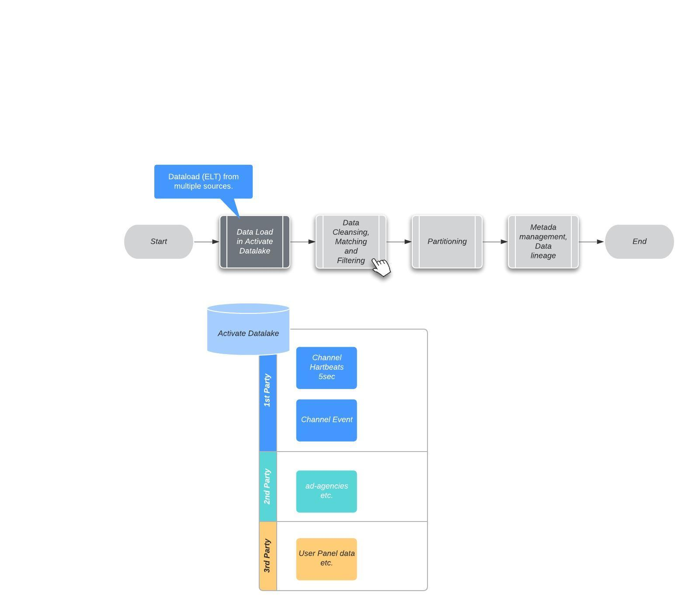
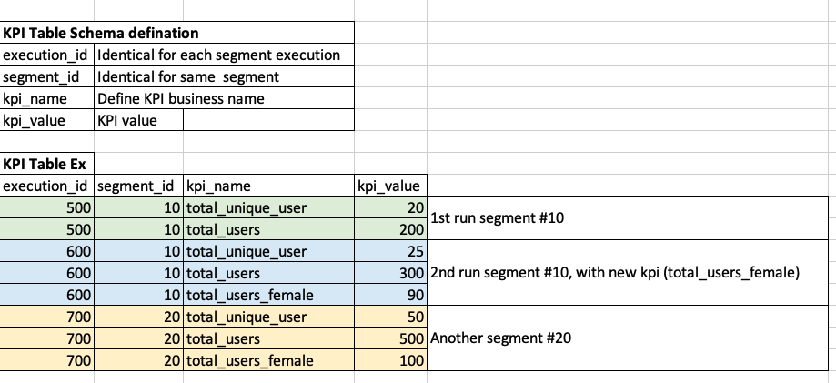
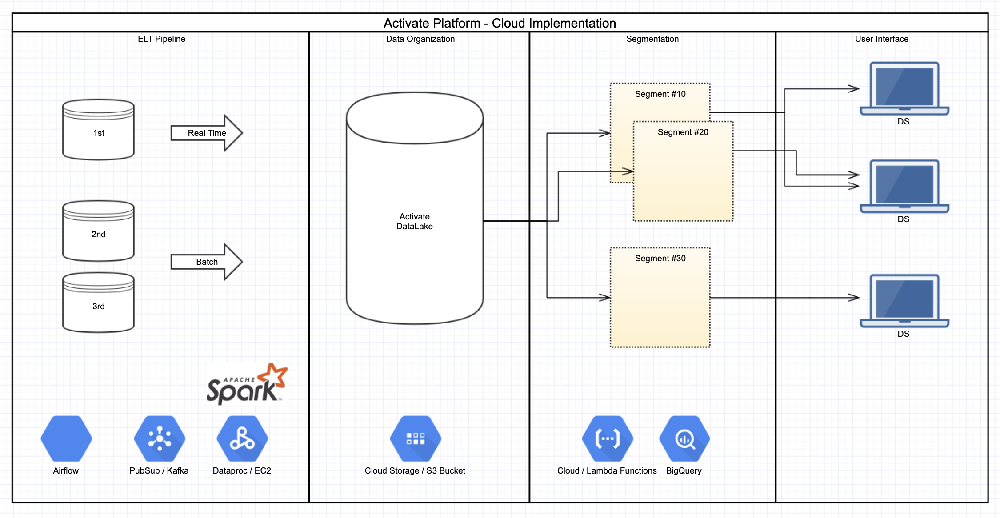

# Activate Platform - Data Design

- ['S'ituation](#10) 
- ['T'asks](#20) 
- ['A'ction](#30) 
- ['R'esult](#40) 

# Situation   

# Tasks

***1. Data Organization.***  

  - Activate dose have 2 types of data ingestion: Realtime, batch
  - Realtime Ingestion will be for 1st party data, comming from device every 5 seconds or on event.
  - Further Data pre process happen before data sotred to cloud storage. 
  - Data Partition and Bucketing are important strategies for 'Segmentation' queries
  - Tools for data discovery and metadata management service needs to setup.
  
  
  

***2. Output KPIs and analytics.***  

  - Generic KIP table to store KIP from all the segmemts. 
  - Partition streategy put in place to efficiently fetch KIP. 

***3. Lookalike Model***
   - A graph like structure could be though to achive connections between segments.
   - Or perhaps a Recomendation algorithm could be develop to learn pattrens in segment usage.
   
   

# Action

***Activate Platform - Cloud Implementation ***

  - Google cloud service is assumed while designing this solution, but this could be replace by AWS services easstright away.
  - Apache Spark will be choice of the technology for data ingestion and processing for both batch and realtime.
  - File based storage could be ideal with storage format like AVRO.
  - Most of the tricky functionality could be achive using Cloud Native services.
  - Ex. storing the results of segments for some period of time, so that next time effort could be save is achived using Google BigQuery.
 

# Result
- We have achived cloud native solution with most of the out of box and battle tested technology.
- Solution is highly scalable and elastic.
- Cloud Native SaaS products offers cost efective pricing strategy.
- Apache Spark is ideal for batch and realtime needs for Bigdata application.

